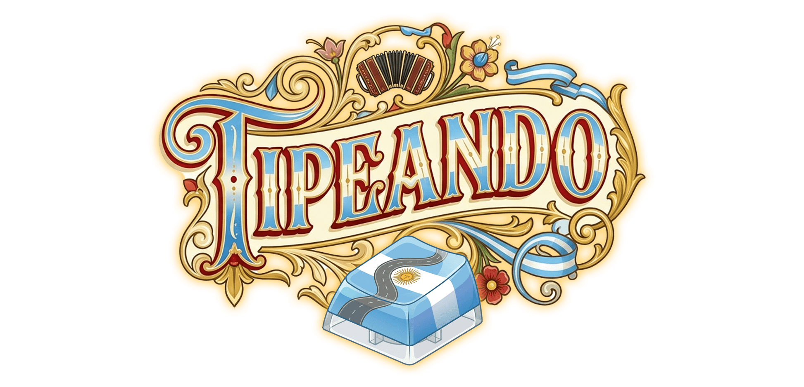
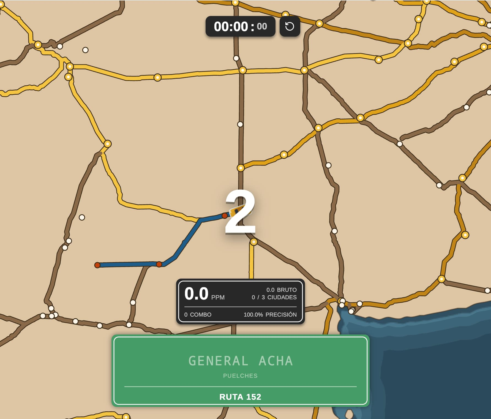

<p align="center">
  
</p>

<p align="center">
  <strong>A typing game across Argentina's National Routes.</strong><br>
  Pick a route on the map and type the towns along it, in order, while your car drives down the road.
</p>

<p align="center">
  <a href="https://tipeando.com.ar">Play</a> ·
  <a href="https://tipeando.com.ar/por-que-tipear.html">Why typing</a> ·
  <a href="https://tipeando.com.ar/ensayo.html">Essay</a>
</p>

---

> **Tipear** — Spanish adaptation of the English verb *to type*, used across much of Latin America to mean "to write using a keyboard."

## About

TipeAndo is a Spanish-language typing game built around Argentina's *Rutas Nacionales*. Each route is a run: you type the name of every town along it, and a marker moves along the real road geometry as you go. You practise typing and learn the country's map at the same time.

<p align="center">
  
</p>

It is a desktop game: it needs a physical keyboard. There is no account and no backend. Everything runs in the browser, and progress is stored locally on each device.

## Features

- **98 National Routes** and around 400 towns, drawn from official road-authority data.
- **Live stats:** gross and net WPM, accuracy and combo, with your best run saved per route.
- **Clean-town combo** that rewards accuracy, with escalating sound cues.
- **Accent-friendly input:** `ñ`/`n` and accented/plain vowels both count by default, with an optional strict mode in Settings.
- **Unlockable keyboard sound packs** and achievements.
- **Keyboard-first controls,** including a one-key restart.

## Why

The motivation behind the game, and the research it builds on (typing fluency, the production effect, retrieval practice and game-based learning), is laid out in two pages:

- [**Por qué tipear**](https://tipeando.com.ar/por-que-tipear.html): the evidence, with sources, plus a lesson guide for teachers.
- [**Escribir el mapa**](https://tipeando.com.ar/ensayo.html): an interactive essay on why TipeAndo is designed the way it is.

## Getting started

Requires Node.js and Yarn.

```bash
yarn install
yarn start            # dev server on http://localhost:1234
```

| Command | Description |
| --- | --- |
| `yarn start` | Dev server on port 1234 (HTTP) |
| `yarn start-vite-ssl` | Dev server on port 443 with HTTPS, using `certificates/localhost-key.pem` and `certificates/localhost.pem` |
| `yarn build` | Type-check with `tsc`, then build with Vite into `dist/` |
| `yarn preview` | Serve the production build |

## Tech stack

- **TypeScript** with no UI framework. Classes communicate through DOM `CustomEvent`s.
- **Vite** for dev and build, with a small custom plugin that compiles **Pug** views into the HTML pages.
- **Sass** (module system) for styles.
- **Canvas 2D** map renderer, using pre-simplified, quantized route geometry.
- **GSAP** for animation.

`src/js/app/MainApplication.ts` is the composition root where everything is wired together (`src/js/main.ts` is a tiny loader that imports it). [`CLAUDE.md`](CLAUDE.md) has a deeper architecture walkthrough.

## Data

Routes and towns live in `src/assets/data/routes.json` and `src/assets/data/cities.json`, a shared town catalog referenced by id from each route. See [`data/README.md`](data/README.md) for the schema, id rules, and how to regenerate and validate the data.

### Sources

- [Rutas Nacionales dataset](https://datos.gob.ar/dataset/transporte-rutas-nacionales), datos.gob.ar
- [Georef API reference](https://www.argentina.gob.ar/georef/referencia-completa-de-la-api) and [docs](https://datosgobar.github.io/georef-ar-api/)
- [Georef localities endpoint](https://apis.datos.gob.ar/georef/api/v2.0/localidades)
- [Jurisdiction boundaries](https://portal-andino.datos.gob.ar/dataset/limites-entre-jurisdicciones)
- [Rutas nacionales de Argentina](https://es.wikipedia.org/wiki/Rutas_nacionales_de_Argentina), Wikipedia

## Credits

### Keyboard sounds

Keyboard sound packs come from [Mechvibes](https://mechvibes.com), normalized into `public/sounds/keys/<id>/`.

| Pack | Id | Author |
| --- | --- | --- |
| Cherry MX Red | `cherrymx-red-abs` | Mechvibes (pre-installed) |
| Cherry MX Blue | `cherrymx-blue-abs` | Mechvibes (pre-installed) |
| EG Crystal Purple | `eg-crystal-purple` | Mechvibes (pre-installed) |
| Model F XT | `model-f-xt` | Rezenee |
| Creams | `creams` | Aksh Aggarwal |
| Unicomp Classic | `unicomp-classic` | Thànhh the Xignature |
| Typewriter ("Typewriter 1.0 Beta") | `typewriter` | thonkadonk |
| Fallout Terminal | `fallout-terminal` | Ditoxin |
| Animalese ("Isabelle Animal Crossing") | `animalese` | Nihilistic Janitor |
| Animal Crossing: New Leaf | `animal-crossing-new-leaf` | Ameer Yaqoob |
| Chrono Trigger ("Chrono Trigger Keyboard") | `chrono-trigger` | M. Kirin |

## Roadmap

- [ ] Fun facts about routes and towns

<p align="center">Made by <a href="https://gianniballerini.dev/">Gianni Ballerini</a>.</p>
